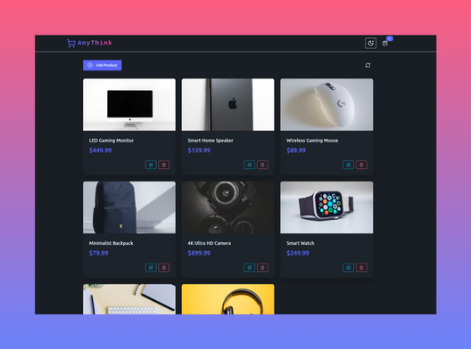

# 🛍️ AnyThink – Product Listing App

A sleek, full-stack product management application built with the **PERN stack** (PostgreSQL, Express, React, Node.js). Designed like an e-commerce platform, it lets users add, edit, and delete products

---

## 🚀 Features

- **Product Management**  
  Add, edit, or remove products with intuitive UI components.

- **Theme Toggle (Light/Dark)**  
  Switch themes instantly from the top-right corner.

- **Real-Time Product Counter**  
  Displays the current number of products in the navbar.

- **Responsive UI**  
  Built with modern UI practices for clean display across devices.

---

## 🛠️ Tech Stack

- **Frontend**: React, Tailwind CSS
- **Backend**: Node.js, Express
- **Database**: PostgreSQL
- **API Communication**: RESTful API
